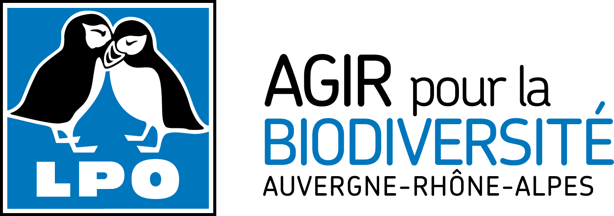
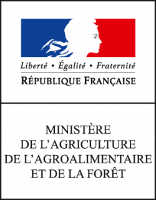
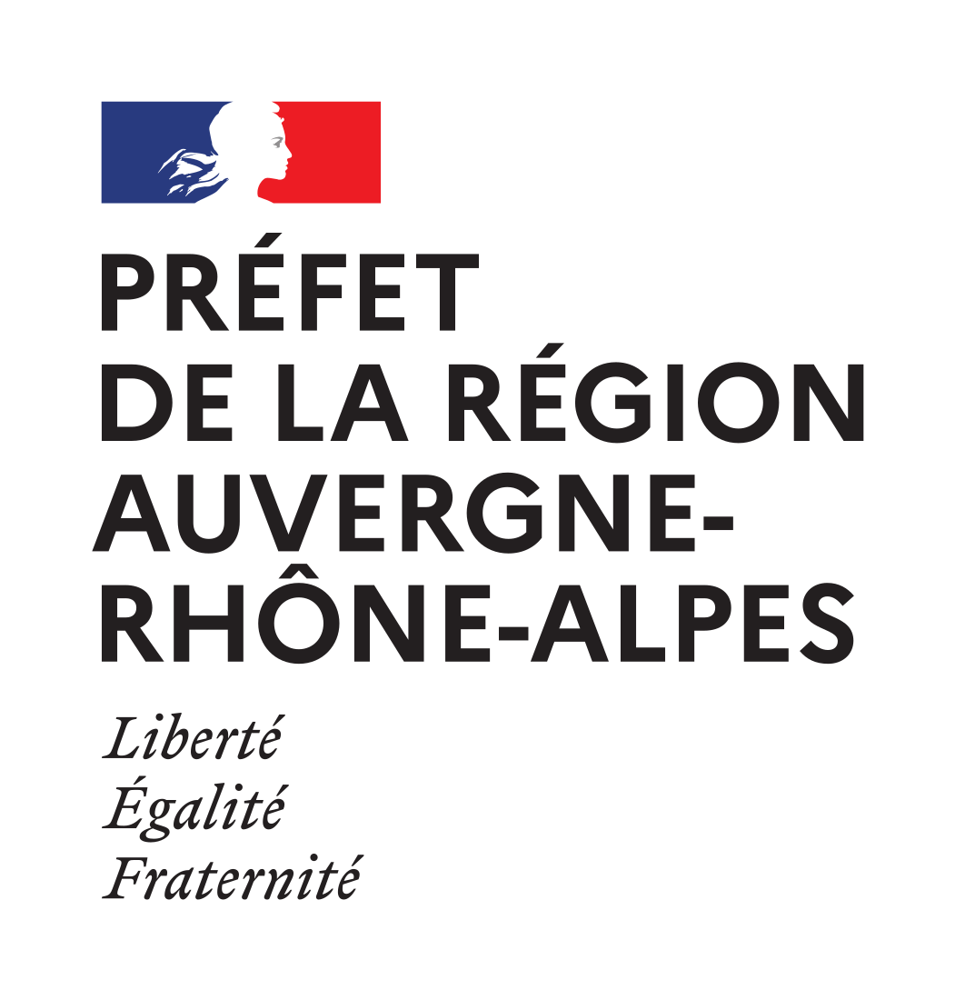
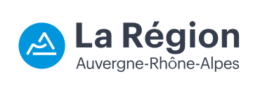

# ForetAuraVue

Site internet de présentation des espèces de vertébrés forestiers à enjeux en Auvergne Rhône-Alpes développé par la LPO Auvergne-Rhône-Alpes dans le cadre d'un programme mené avec le soutien financier de la région Auvergne-Rhône-Alpes

Minisite développé avec VueJS, Leaflet (vue2-leaflet) et BootStrap (bootstrap-vue.js).

# Adresse de l'appli

https://aura-partage.lpo.fr/cartes/foretaura/

## Project setup
```
npm install
```

### Compiles and hot-reloads for development
```
npm run serve
```

### Compiles and minifies for production
```
npm run build
# Or for subpath
npm run build --baseUrl="/my/sub/path/"
```

### Run your tests
```
npm run test
```

### Lints and fixes files
```
npm run lint
```

# Licence:
* licence GPL3

# Contributors:
* @lpofredc : Developer
* @mbricquir : Developer
* @lpojgc : Project manager

# Un projet développé par
* [LPO Auvergne-Rhône-Alpes](https://auvergne-rhone-alpes.lpo.fr)

<p style="text-align: center;"></p>

# Un projet financé par
* [DRAAF Auvergne-Rhône-Alpes](https://draaf.auvergne-rhone-alpes.agriculture.gouv.fr/)
* [DREAL Auvergne-Rhône-Alpes](http://www.auvergne-rhone-alpes.developpement-durable.gouv.fr/)
* [Région Auvergne-Rhône-Alpes](https://www.auvergnerhonealpes.fr/)

<p style="text-align: center;">&nbsp;&nbsp;</p>

